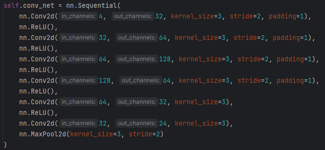
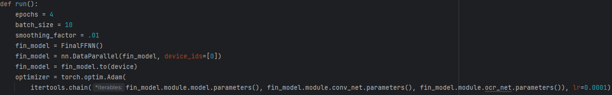

# Where in the World am I?
Approaching GeoLocation with Machine Learning

## Authors
- Nick Boddy
- Caleb Raschka
- Morgan Turville-Heitz

This project was made for CS 766 Computer Vision at UW-Madison.
[Project Presentation](https://docs.google.com/presentation/d/1akX8-ajRWpmPtD93Bkqu015D39DX9NZOcdgDnppzA8Q)
[GitHub](https://github.com/Cdogsnappy/WITWAI)

---

## Motivations
[GeoGuessr](https://www.geoguessr.com/) is a web-based game wherein the player is dropped into random places in the world and is given visual information via Google Street View. Using the information presented, the player must make a guess as to the coordinates of the image by placing a pin on the globe.


Due to the game's popularity, a competitive scene has arisen in which certain players have become more or less experts at GeoLocation. These players have learned and harnessed certain skills that allow them to excel. These include but are not limited to:
1. Reading and understanding text
2. Identifying language/script of text
3. Recognizing different types/styles of:
    - Architecture
    - Vehicles
    - Biomes
    - Flora
    - Fauna
    - Geography
4. Understanding geographical distributions and correlations of the presences of these identifications

This last point is ultimately key. For a player to make the best prediction with the information available, they must rely on their understanding of how all of these pieces assemble to produce a geographical location that makes sense.

By now it is surely obvious that the task of GeoLocation is learnable. Our approach to this problem is designed to leverage how skilled GeoGuessr players approach the game.

## Prior Work

Prior applications of machine learning to GeoLocation have used a number of different models with varying degrees of success.

[DeepGeo](https://arxiv.org/abs/1810.03077) uses a CNN

Website:

The final project report must be submitted to Canvas as a website. The website must include:

- Project title and team members
- Link to presentation slides
- Link to github repository.
- Intro presenting and motivating the problem
- Your methodology (method, data, evaluation metrics). If applicable, highlight how it differs from prior work (new experiments, new methods, etc)

# Methodology 

### Overview 

We have implemented a multi-model pipeline in order to classify the country label of each image. This is utilizing an OCR text recognition model, a SotA LLM for language identification, an image segmentation model, and a deep feedforward network. All code is written in python, using either Jupyter notebooks or Python scripts. Implementation of the FFNN is handled in PyTorch. 

### Dataset(s)

The initial dataset that was used during our pipeline testing is a set of 10,000 images and scraped from google street view. These can be found at [Google Street View](https://www.kaggle.com/datasets/paulchambaz/google-street-view/data) - the script *kaggle_data_prep.ipynb* can be used to collect this dataset. Images are 640x640. We found a very low density of text, as well as a low density of segmentable features, in this dataset, so this was only used for testing the initial implementation of our models, and was not used during model training. 

For the model training, we attempted to collect two separate datasets:
1. Google Maps Street View (gmaps) Data
2. OpenStreetMap API - Mapillary (mapillary) Data

The gmaps dataset is collected by the code in the later half of the *mapillary_google_maps_data_prep.ipynb* script. The data collection is performed as follows:

1) We load a GeoPandas object (*world*) containing the polygon representation of countries. This maps a (longitude/latitude) pair to a specific country ID.
2) We join *world* with a new GeoPandas object containing the Urban Areas polygon database, *urban_areas*. This is the Global Human Settlement Layer R2019A dataset [GHS-FUA R2019A](https://human-settlement.emergency.copernicus.eu/ghs_fua.php). By joining the two objects, we are able to restrict sampling to urban areas, in order to target higher-information images when sampling.
3) We then sample 66% of images from "Urban areas" and 33% of images from "Rural areas," as defined above.
4) Sampling of coordinates is performed as follows:
- a. We randomly generate a (lat/lon) pair.
- b. We create a Shapely.geometry point from the pair.
- c. We join the Shapely point with either the *urban_areas* object or the *world* object, depending on if the sample is intended to be rural or urban.
- d. We check if the joined Shapely point is found within the selected object, and if so, we then check if the point is in Europe.
- e. If the object is in Europe, we return the (lat/lon) pair and the country as a label for the datapoint.
5) If the (lat/lon) sampling was succesful, we have to perform an important step - identifying an address that we can query the API for.
- a. We use a gmaps object with the function *reverse_geocode* to identify an address based on a (lat/lon) pair.
- b. If there is a nearby address within ~5 kilometers, the closest address is returned. 
- c. This address then needs to be parsed, in order to query the API for an image in step 6). 
6) If the address sampling was succesful, we query the Google Maps API, and query the API for an image. This functions as follows: 
- a. We use a standard HTTP query, with the address as an argument in the HTTP request.
- b. If we receive a 200 response code (i.e. succesful query), and if the image is not empty (image size > 10kb), we store the image. A non-negligible number of images result in empty returns, which are blank with an image filesize ~5kb.
7) Finally, we store the (lat/lon) and country ID in a .csv file, and store the image with the filename corresponding to the dataset's index. 

### Data Processing

Mapillary is an open-source dataset of publicly uploaded images by users around the world, supported by the OpenStreetMaps project. The mapillary dataset is collected similarly to the gmaps dataset.


### OCR Language Guessing


[EasyOCR](https://github.com/JaidedAI/EasyOCR) is used for all text extraction. This is a publicly available, built-in OCR library for Python. It supports a number of languages, and importantly, supports both Latin and Cyrillic scripts. Outputs are of the form ["Text", "Confidence", "Bounding Box"]. If multiple pieces of text are found, they are all returned as a nested list. 

There are two separate methods for the OCR model. The first method is what is used for the kaggle and gmaps dataset, and the second method is used for the mapillary dataset. However, the two methods are identical after a certain point, so I will discuss the data preparation that is needed for the kaggle and gmaps datasets first, before discussing how all three datasets are processed by the OCR model.


#### kaggle/gmaps Preparation

The primary issue is that the kaggle/gmaps datasets contain Google© watermarks. Therefore, OCR text recognition will see each Google watermark, and dominate the results of the text extraction. The method of handling this is below:
1) First, we create an English-only EasyOCR instance. 
2) Then, this is run on every image in the dataset.
3) Detected strings are then matched against the following:
- ["gccole", "cgoogle", "cgccgle", "cgcogle", "cgocgle", "google", "gccgle", "gcogle", "gocgle", "gocnle", "gcogie", "oogle"]
4) If any matches with the above list are found, we overwrite the bounding box for that text with black pixels. This image is then saved into a new directory, which is used for the OCR extraction.

After this point, the kaggle/gmaps preparation is identical to mapillary, as mapillary does not have constant watermarks. There are watermarks on the mapillary dataset, but there are far more variations, since the dataset is open sourced.

#### OCR Extraction for mapillary/kaggle/gmaps

Extraction is quite simple for all datasets.

1) We create two separate EasyOCR instances - *latin* and *cyrillic*. These contain all relevant European languages for the given script.
2) We run both of these models on every image in the dataset. We choose the results from the highest-confidence results (e.g. if *cyrillic* has confidence 0.9 and *latin* has confidence 0.8, we keep all *cyrillic* results).
3) This is thresholded by the *THRESHOLD* parameter.
4) We store the extracted text and the confidence for each extracted text in a new .csv file.

#### Language identification.

Here we use a state of the art (SotA) Large Language Model, Claude 3 Opus, in order to guess the language of extracted text.

The order of operations follows thusly:
1) We load the extracted OCR text. All text above *THRESHOLD* for the given model is used.
2) We generate a header containing the *system prompt* and the *load*, i.e. the initial instructions to the LLM, and the text which it responds too.
3) This is sent as an HTTP request to Anthropic. It costs roughly $15 for the ~500 pieces of text we found on our training dataset. Please note, if you are reproducing this on your machine, it is relatively expensive to query the API.
4) The LLM response is returned from the HTTP .get request, and is interpreted as a .JSON load. This is then thresholded again by the LLM's internal confidence. Interestingly, the LLM is apparently incapable of giving 5 as a confidence, and only very very rarely gives 6 as a confidence. 
5) The highest confidence language is stored in the final .csv file, which is passed forward to the Feed Forward network. 

#### LLM system prompt:
" 
You are tasked with determining the language of a string, or set of strings. The strings were extracted from randomly sampled images in a dataset. The strings may or may not be meaningless.

The input will be formatted as a JSON input. There will be two entries - 
1) A list of confidence metrics, ranging from 0 to 1, which is output from an EasyOCR text extraction model. One confidence metric for each string.
2) A list of strings, which were extracted from the model.

Input format is of the form:
{
  "confidence": [0.5, 0.3],
  "text": ["Extracted text 1", "Extracted text 2"]
}

Naturally, the confidence at index i corresponds to the string at index i.

Please output two values:

1) An integer confidence between 0 and 10. This does not need to be precise - I'd just like to differentiate between "very confident" and "not at all confident". As a model, you are effectively performing two functions: a) filtering out meaningless text OCR (for example, a response like "Kf8xc"), and b) identifying the language if and only if you're very confident.
2) A language guess, using the 2-character standard identifier, e.g. "en" or "de"


Your output should be of the form:

{
  "confidence": 3,
  "lang": "en"
}

Do not include any additional information in your response - only return the JSON output as described above. 

If multiple languages seem present (for instance, both Serbian (Latin) and Serbian (Cyrillic), I would like you to return both languages, sorted by the confidence, as lists. For instance:

{
  "confidence": [0.7, 0.4],
  "lang": ["en", "de"]
}

If a language has no matches (for instance, if the language is Mongolian or Chinese, which are not in the list of target languages), the confidence should be set to 0. 
If all of the text is numeric (as would be expected from e.g. speed limit signs) the confidence should be low. 
If the text seems like the metadata of a camera (for instance, data/time info from a dash-cam), confidence should be set very low, as the text is unrelated to text within the background. 
If the text appears to have small typos (e.g. "Rrestaurant"), you may lower the confidence, but assume that this is due to variations in the font, or errors in the OCR model.
If the text is the name of a city, retail store, or other regional entity, (for instance, "Wrocław"), please return the dominant language spoken in that region (in this case, "pl").


The languages that you may choose from are as follows:

{
"Belarusian": "be",
"Bulgarian": "bg",
"Czech": "cs",
"Welsh": "cy",
"Danish": "da",
"German": "de",
"English": "en",
"Spanish": "es",
"Estonian": "et",
"French": "fr",
"Irish": "ga",
"Croatian": "hr",
"Hungarian": "hu",
"Icelandic": "is",
"Italian": "it",
"Latin": "la",
"Lithuanian": "lt",
"Latvian": "lv",
"Maltese": "mt",
"Dutch": "nl",
"Norwegian": "no",
"Polish": "pl",
"Portuguese": "pt",
"Romanian": "ro",
"Russian": "ru",
"Serbian (Latin)": "rs",
"Serbian (Cyrillic)": "rc",
"Slovak": "sk",
"Slovenian": "sl",
"Albanian": "sq",
"Swedish": "sv",
"Turkish": "tr",
"Ukrainian": "uk"
}

If the input is invalid, please return instead error 4xx, and a description of why the input is invalid.

{
 "response": 4xx,
 "error": "The issue with the input"
}
"
#### Example LLM input/output 

Input:
{
  "confidence": [0.999],
  "text": ["Schadenfreude"]
}

Output:
{
"confidence": 10,
"lang": "de"
}


### Segmentation 

### FFNN
The Feed Forward architecture consists of two parts. 

#### Fully Convolutional Network
The [fully convolutional network](https://arxiv.org/pdf/1411.4038) (FCN) accepts the original image data with the alpha-encoded 
semantic segmentation map as input. The FCN has two main purposes:
1. Image shape augmentation  
The initial input shape of the image is 1024x1024x3, which is too large for our fully connected 
linear layers. As a result, we use the FCN to downsample in the spatial dimensions of the image, and upsample 
in the channel dimensions, such that the image is only 29x29x24 (20184 features).

2. Feature Extraction  
As with other convolutional networks, we hope that the FCN can extract some feature data or relationship
between the original image and the segmentation image.


Following the FCN is a feed forward block (FFNN) that takes the multimodal data (FCN output + OCR) as input. The OCR data
is run through a single layer network before being passed to the final network. Then the FCN output is flattened and concatenated 
with the OCR output in a 1-d tensor.
The FFNN is meant to derive a probability vector given the multimodal input. The model employs a one-hot vector with 
smoothing for the truth values. We train on balanced classes with normalized images. We have experimented with
dropout regularization and without, and the results are fairly similar. We chose our loss criterion to be
Cross Entropy as it does well on balanced multiclass problems. There were attempts to use weighted cross entropy loss
for the imbalanced classes, but this resulted in mode collapse too often. 

## Quantitative Results
Our model exhibits fairly unstable behavior under our current data and parameters. For our evaluation metrics, we 
simply used 0-1 accuracy. When considering our options for metrics, we decided that a notion of proximity would be ignored, 
contrary to the rules of GeoGuessr. Thus, the model loss is the same when it guesses a country 50 km away that it would be if it
guessed a country 500 km away. This is reflected in our truth vectors mentioned in Methodology. 

The model does not train well under these conditions, and is very sensitive to initialization. We found that when training for too long 
the model quickly experienced mode collapse, and so a small amount of training epochs are used. Without mode collapse, we get varying levels of accuracy.
The saved model included reported an accuracy of ~6%. This is of course not a great result, but it is better than randomly guessing, 
as we have 23 classes which would have a random guess accuracy of ~4.5%. This could be due to chance from running the model multiple times, but we think that the model
is learning, just not the proper things yet.


# Demo

### It is _strongly_ recommended that you run the Demo on a system with CUDA enabled. 

There are a few things needed for the demo.
First of all, you'll want to run 
```bash 
$pip install -r requirements.txt 
```
in the project directory.

## Data Collection 
You will need: 

- A Mapillary API key, generated at [Mapillary](https://www.mapillary.com/app/?lat=20&lng=0&z=1.5&menu=true). The Mapillary API key should be placed in your project directory. If you would like it elsewhere in your system, you'll need to update the path in *mapillary_google_maps_data_prep.ipynb*.
- A Google Maps API key, generated at [Google Maps Developer Dashboard](https://developers.google.com/maps). Similarly, The Google Maps API key should be placed in the project directory. 
- A Kaggle API key, generated at [Kaggle](https://www.kaggle.com/). You'll want to move the Kaggle API key to `~/.kaggle/kaggle.json`

Then, you will be able to run *mapillary_google_maps_data_prep.ipynb* to generate your dataset. The notebook is currently set up for mapillary - you can also use this same notebook for gmaps. If you would like to use the kaggle dataset instead, you can use *kaggle_data_prep.ipynb*.


## OCR and Language Identification

The notebook should work as is, but you'll want to run the watermark removal blocks if your dataset is gmaps or kaggle. This code is found at the end of the script, and should not be used for mapillary (however, if you'd like to try and remove other watermarks from the mapillary dataset, this codeblock would work as well).

## Semseg


## FFNN Training and Testing
Prerequisites: OCR Training + Segmentation Training

There are some auxiliary files that won't be necessary for use.

1. [ClassFrequency.py](Classifier/ClassFrequency.py) is used to calculate the frequency of each class in the data. This was used for data
normalization and is not necessary for training.

2. [TestSetBuilder.py](Classifier/TestSetBuilder.py) is used to build a test and train dataset using all of the data. This does not account
for class imbalance and thus will produce completely unstable training that will result in mode collapse.

Some files will be used automatically and won't need to be called by a user.

1. [CustomImageDataset.py](Classifier/CustomImageDataset.py) is an implementation of PyTorch's [Dataset](https://pytorch.org/docs/stable/data.html#torch.utils.data.Dataset) module which can
take the data for training and testing and feed it to the neural network for us.

2. [final_net.py](Classifier/final_net.py) has been wrapped inside two files, ModelTester and ModelTrainer, and thus doesn't need to 
be used for reproducing results. However, any model tuning would be done in final_net.

### How to Train
1. Run [BalancedSetBuilder.py](Classifier/BalancedSetBuilder.py)  
This script will build a dataset with balanced classes for the model to run on. The
data_size parameter determines how many data points for each country to use. Note that
countries with < data_size samples will be skipped, and so the used_countries.csv file must be updated
to reflect the countries that are present in the data.
2. Run [ModelTrainer.py](Classifier/ModelTrainer.py)  
Yes, it's that easy. If you are content with the model 
parameters of final_net.py, then go ahead and run ModelTrainer. This will run the model for the 
given number of epochs, using the given batch size, and will test the model on the test_data generated from
BalancedSetBuilder. If you do wish to alter training hyperparameters, they can be found here in [final_net.py](Classifier/final_net.py):

Note that the training parameter learning rate cannot be decoupled for the two submodels in the FFNN; The weights must be updated simultaneously through
backpropagation as there are no ways to train the intermediate results of the FCN otherwise. You can also alter additional parameters such as model depth in the FFNN class definition, but note that performance will be impacted.

3. Run [ModelTester.py](Classifier/ModelTester.py)  
You can specify a saved model file (.pt) to use for testing on the 
current test dataset. This will reproduce the results that ModelTrainer outputs at the end of training
if you run it right after ModelTrainer, but if you run BalancedDataSetBuilder again
then the saved model will be tested on a new test set. One saved model is provided [here](https://drive.google.com/file/d/1M7lZMOBQPbvjybKUeA0rDZaEyG-xruoq/view?usp=sharing).


## Conclusion
We believe that we employed methods that could effectively extract information out of our data. However, there were some
issues that impacted the effectiveness of training and the model as a whole.
1. Data quantity + quality 
Our data was sparse for certain countries, and the amount of data diversity in the images was not very high.
While we think it would be interesting to approach the problem with the latter still in place to see how a network deals
with such a problem, we found that having so little good data made the network train poorly.
2. Network density  
Our network likely didn't have the depth and width required to represent the patterns in data that we needed it to. This is a 
shortcoming of our choice to train and test on consumer grade hardware rather than industry standard equipment. 

We found the OCR output and much of the segmentation output to be very promising. The networks were able to apply themselves to
our dataset well and give accurate outputs. 


